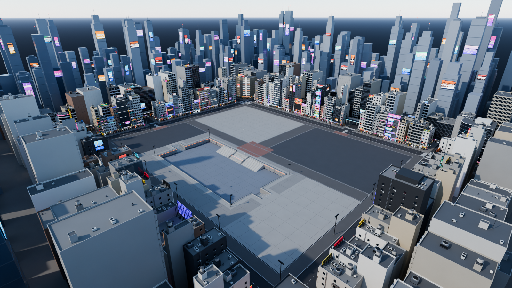
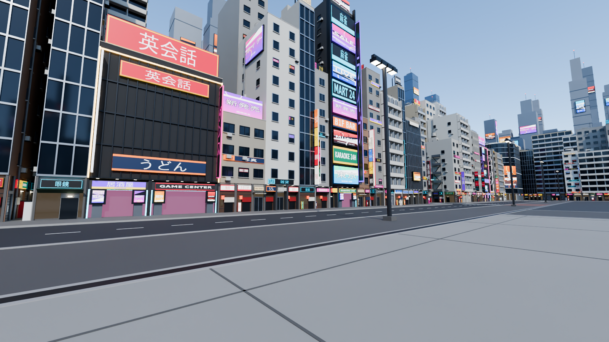
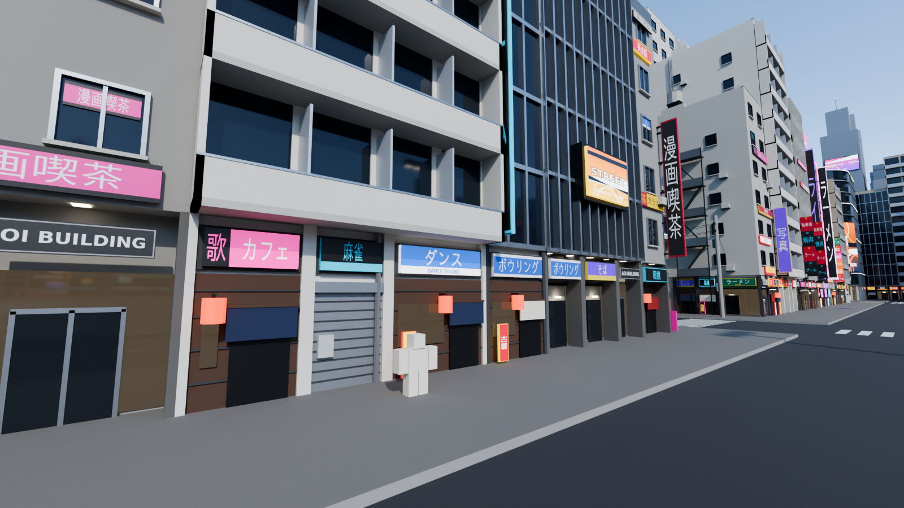
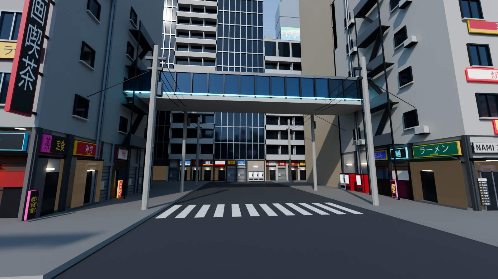
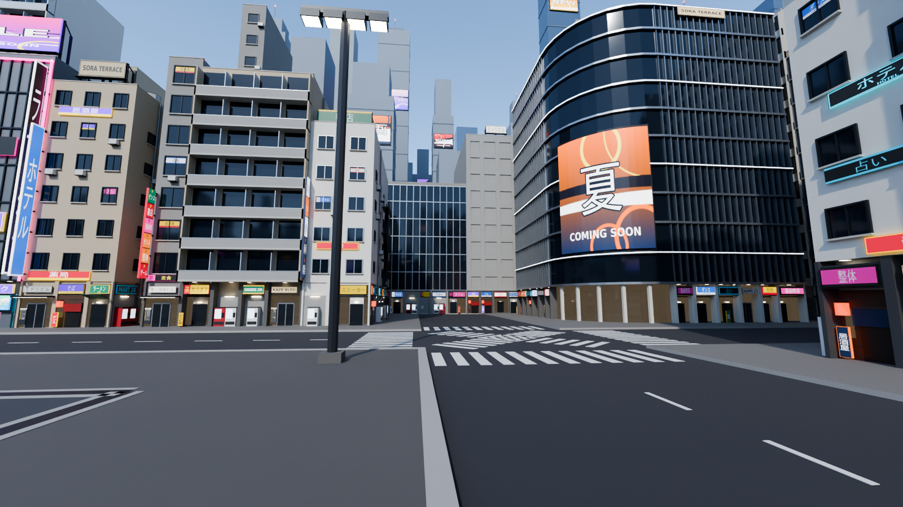
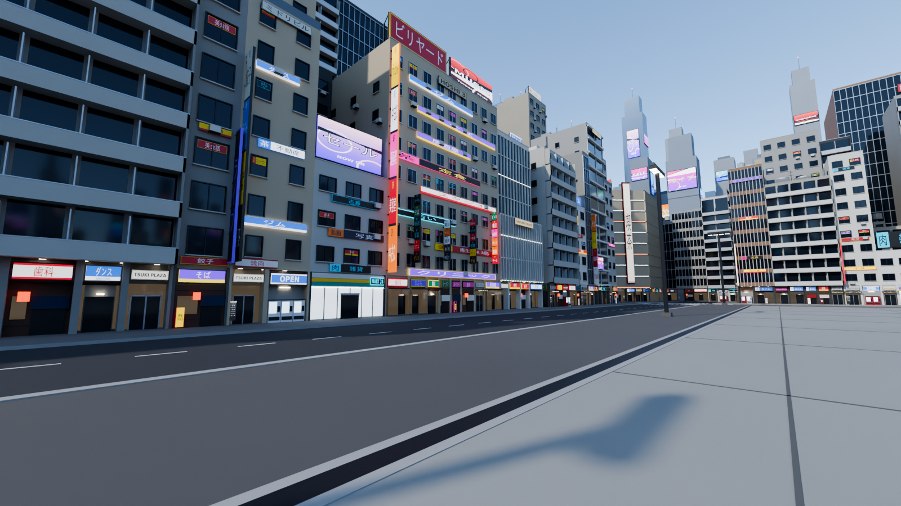
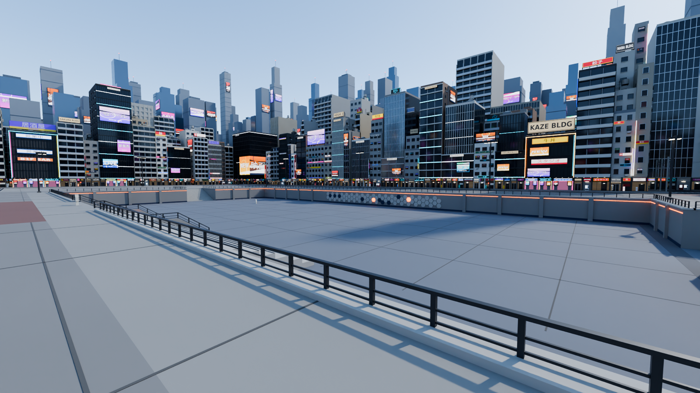
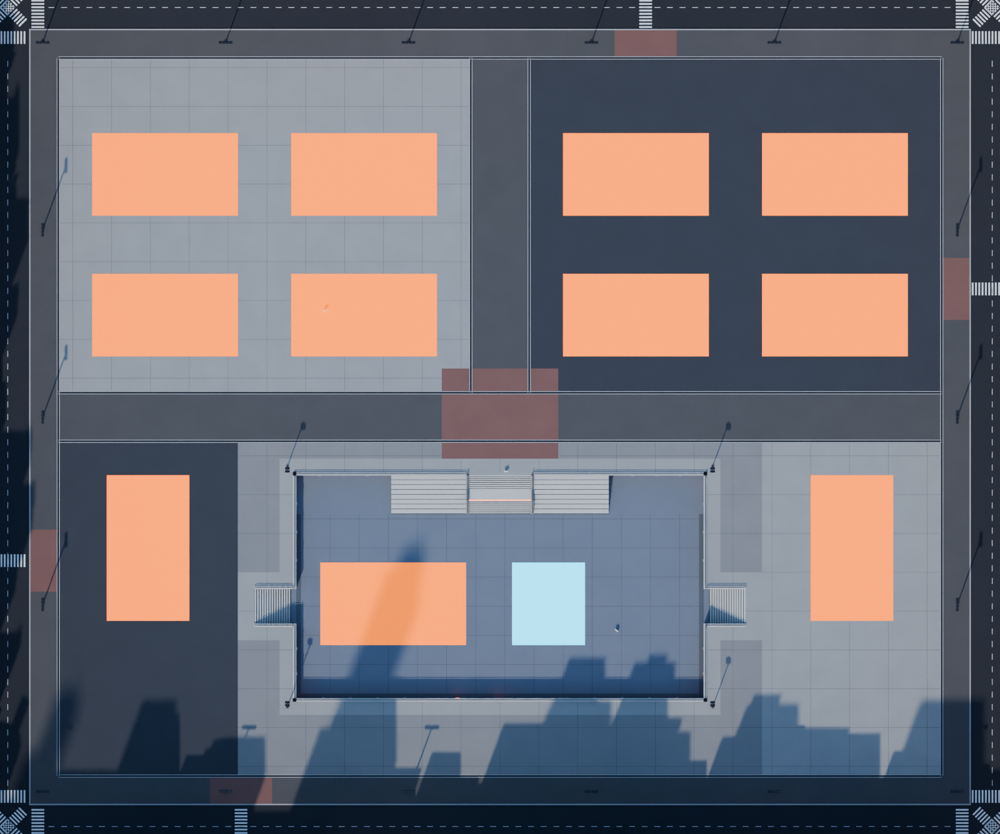

# HEX! — City Basketball Park (environment shell)

A huge, mostly empty, flat basketball plaza in the middle of a dense, **Shibuya-inspired** commercial
district, with one sunken practice area reached by wide stairs. **This is only the shell.** No courts,
hoops, benches, shops, leaderboards or props are in the playable area. The empty space is intentional,
for you to fill in Roblox Studio.



| North frontage (player height) | Shop street / scale check (5.2-stud avatar) |
|---|---|
|  |  |
| **Side street: skybridge, utility poles, cables** | **NE corner: curved-screen landmark + scramble** |
|  |  |
| **West frontage** | **Practice area from the rim** |
|  |  |

All views are in [`renders/`](renders/).

---

## Scale: read this first

**1 Blender unit = 1 Roblox stud.** Everything was built at final size. Nothing was scaled up afterwards
to make the map look big. The map is big because the distances are big, not because the objects are.

| Element | Size (studs) |
|---|---|
| Reference avatar (hidden `SCALE_REFERENCE` collection) | 5.2 tall |
| Shop door | 4.5 × 7.5 |
| Ground floor (shops) / upper floors | 15 / 11–13 |
| Vending machine | 3.4 × 2.4 × 6.2 |
| Stair riser × tread (grand stair / side stairs) | 1 × 2 / 1 × 2.5 |
| Railing top above walking surface | ~3.3 |
| Curb (plaza / sidewalk to street) | 0.6 |
| Sidewalk / perimeter street width | 18 / 44 |

### Court budget
No HEX court FBX was in the repo, so the layout uses a **deliberately generous budget of
150 × 85 studs per full court** (plus run-off). If your real court is smaller, everything simply fits
with more room. If it's larger, drop the FBX in [`court/`](court/) and rebuild. The script imports
and measures it **first** and grows the map. It never resizes your court and never shrinks the map.

### Footprint
| Area | Size (studs) | Level |
|---|---|---|
| Main plaza (playable) | **970 × 800** | 0 |
| Practice floor (total / unobstructed) | **420 × 230 / 420 × 190** | −16 (one storey) |
| Building frontage line (from map centre) | ±547 (E/W), ±462 (N/S) | |
| Midground ring | starts 110 beyond the frontage | |
| Skyline | out to ~1,350 from centre | |



*Capacity check (orange = full court 150 × 85, cyan = half court): **10 full courts on the main level**
plus **1 full and 1 half court on the practice floor**, with room to spare. These ghosts sit in a hidden
reference collection and are **not exported**. They are not court markings.*

---

## The city wall: Shibuya architecture pass

The Tokyo identity comes from the **buildings themselves**: narrow Japanese mixed-use commercial
buildings, not office towers with ads on them.

**Foreground building types** (mixed along every side, with irregular widths and heights):

| Type | What makes it Tokyo |
|---|---|
| `Zakkyo` (multi-tenant) | Tiled facade, small punched windows with frames and sills, tenant sign panels on every few floors, lettering on window glass, exterior AC units, projecting blade signs or a full-height **stacked tenant kanban**, exterior steel emergency stair on exposed sides, rooftop water tank and sign lattice |
| `Pencil` | 11–17 studs wide, 7–12 floors, squeezed between neighbours, full-height vertical sign |
| `Mansion` | Shops below, Japanese apartment balconies above (frosted panels, partitions, AC units on every balcony) |
| `Louver` | 1970s/80s concrete ribbon windows + vertical fins, lit floor signs |
| `Modern` | Newer fashion-building glass with fins or louvers, building-name sign, medium screens |
| `Arcade` | Game-centre / karaoke building, panel facade covered in lit signs, neon vertical blades, rooftop ad |
| `Low` | 2–4 floor older building with a convenience store below and a big rooftop ad structure |
| `…_Back` | Secondary taller building behind shallow frontage buildings, for overlapping silhouettes |

**Street level** is assembled from shallow facade units, with no interiors: narrow shops with recessed
entrances and door lights; convenience-store fronts (bright glass, generic stripe bands); restaurants
(dark wood, noren curtains, red lanterns, standing signs); arcade entrances (bulb frames, small displays);
service shutters with pipes and meters; building lobbies with **directory boards** and lit canopies; and
**vending-machine alcoves**. Many buildings have the Tokyo-style **set-back arcade** (upper floors
overhang the shopfronts, with soffit downlights). Service alleys between some buildings carry overhead
cables. The side streets have concrete **utility poles** and wires.

**Landmarks** (each with a different silhouette, old and new mixed):

| # | Landmark | Where |
|---|---|---|
| 1 | **Curved screen building**: rounded corner, white floor bands, huge curved display | NE corner |
| 2 | **Stacked sign building**: narrow tower clad in stacked screens and lit sign panels, neon blade | North side, centre |
| 3 | **Glass entertainment tower**: dark glass, illuminated horizontal bands, 3 screens + landmark display | East side |
| 4 | **Japanese commercial block**: tile, dense windows, tenant signs on every floor, blades, kanban | West side |
| 5 | **Giant corner screen**: two huge displays wrapping the corner | SE corner |
| 6 | **Rooftop sign building**: mid-height building carrying a huge steel advertising structure | South side |
| + | Chamfered department store with LED bands and a giant vertical sign; 1980s round-corner fashion building | NW / SW corners |

**Three depth layers:** detailed foreground → medium-detail Tokyo midground (tile / balcony / glass /
louver, rooftop sign lattices, full street level only where a street ends on it) → simple background
skyline. The skyline's **tower layout is unchanged**: its random state is frozen in
`blender/skyline_rng_state.json`. It now carries **digital billboards** (`Billboard_Skyline_###`, wide
and tall-vertical) high up on the park-facing side of the towers, so the ads keep layering all the way
to the horizon.

Cyberpunk stays at roughly 15%: screens, LED edge strips, a few neon blades and light bands. The
architecture itself stays believable.

---

## Layout (unchanged)
```
            N  (side street + glass skybridge, vista screen at its end)
   ┌──────────────────────────────────────────────┐
   │  NW field (concrete)  ║  NE field (asphalt)   │   perimeter promenade (dark pavers)
   │                       ║                        │   + drain channels, light masts
W  │ ═══════ E-W spine ════╬══ brick forecourt ═════│  E
   │  SW wing    ┌─────── grand stair 64w ──────┐   │
   │  (asphalt)  │  seating     ▼     seating   │SE │
   │          ◄──┤  PRACTICE FLOOR  (-16)       ├──►│   side stairs in trenches (36w)
   │   W stair   │                              │ E │
   │             └──── HEX hexagon feature wall ┘   │
   └──────────────────────────────────────────────┘
   44-stud street ring, scramble crossings at all 4 corners
```
* Each corner is an open intersection whose streets run outward and end on midground buildings.
  You see city down every street, never the map edge.
* A rail viaduct runs behind the west frontage (visible down the streets), and a glass skybridge crosses
  the north side street.

---

## Files
| Path | What |
|---|---|
| `blender/HEX_City_Map.blend` | The scene, organised in collections |
| `blender/build_hex_city.py` | The generator. Re-run it to rebuild everything (deterministic) |
| `blender/make_sign_textures.py` | Regenerates the placeholder sign / screen texture atlases (Pillow + a Japanese font) |
| `blender/textures/*.png` | Sign atlases (`signs_h`, `signs_v`) + screen-ad atlas (`screens`) |
| `blender/layout_report.json` | Measured dimensions, triangle and object counts, sign and screen counts |
| `export/fbx/HEX_City_0X_<COLLECTION>.fbx` | One FBX per collection (textures embedded), for the Roblox 3D Importer |
| `renders/` | Preview renders (Cycles) |
| `court/` | Drop your HEX court FBX here |

### Collections
```
HEX_CITY_MAP
├─ MAIN_GROUND            plaza slabs (each a separate convex box), sidewalks, streets
├─ PRACTICE_AREA          FLOOR / STAIRS / RETAINING_WALLS / RAILINGS
├─ BUILDINGS_FOREGROUND   FG_<side>_<nn>_<Type>, FG_<side>_<nn>_<Type>_Back, FG_Corner_<NE|NW|SE|SW>_Landmark…
│                         (+ instanced rooftop equipment & vending machines as children)
├─ BUILDINGS_MIDGROUND    MG_<side>_<nn>
├─ SKYLINE_BACKGROUND     Skyline_Sector_01..16 (very simple)
├─ SIGNAGE                every sign is its own mesh
│  ├─ SIGNS_STOREFRONT       Sign_Storefront_###, Sign_Directory_###
│  ├─ SIGNS_FLOOR            Sign_Floor_###        (tenant panels / window lettering)
│  ├─ SIGNS_BLADE_VERTICAL   Sign_Blade_###, Sign_Vertical_###   (projecting / kanban towers)
│  ├─ SIGNS_ROOFTOP          Sign_Rooftop_###
│  ├─ SIGNS_BUILDING_NAME    Sign_BuildingName_###
│  └─ LED_STRIPS             <building>_LED  (one LED mesh per building)
├─ BILLBOARD_SCREENS      digital displays, one object each
│  ├─ SCREENS_LANDMARK       Billboard_Landmark_###, Billboard_LandmarkCurved_001
│  ├─ SCREENS_LARGE          Billboard_Large_###
│  ├─ SCREENS_MEDIUM         Billboard_Medium_###
│  ├─ SCREENS_SMALL          Billboard_Small_###
│  └─ SCREENS_SKYLINE        Billboard_Skyline_###   (ads on the background towers)
├─ STRUCTURES             light masts, RailViaduct_West, Skybridge_North, utility poles + overhead lines
└─ GROUND_DETAILS         expansion joints, drain channels, plaza curb, street paint
SCALE_REFERENCE (not exported)   5.2-stud avatar dummies, court capacity ghosts, your court FBX
```
See `layout_report.json → sign_and_screen_counts` for exact counts.

### Signs & screens in Roblox
* Every sign and screen is a **thin box with one material**. Its graphic is a cell of a shared texture
  atlas, using generic Japanese shop words only (ラーメン, カラオケ, 居酒屋, 薬局 …), with no real brands.
* **The display face is the object's local +Y in Blender, which should be `Front` in Roblox.** If a
  SurfaceGui doesn't show on Front, use Back. Projecting blade/vertical signs show on both sides.
* Replace any sign by retexturing it, putting a SurfaceGui / VideoFrame on Front, or swapping the part.
  The curved landmark screen has 0→1 UVs across the arc, so a texture or flipbook works. For a
  SurfaceGui/VideoFrame, overlay flat parts.
* LED strips, lanterns, downlights and lit signs are emissive. Set them to **Neon**, or keep the texture
  and raise brightness.

---

## Importing into Roblox Studio
1. **3D Importer → Import** each `export/fbx/HEX_City_0X_*.fbx` (start with 01 and 02).
2. In the importer's **File General → Scale Unit**, choose **`Stud`**. The FBX is tagged in
   metres. If you leave it on Meter, Roblox multiplies everything by ~3.57 and you get the old scale
   problem.
   *Check:* the plaza must measure **970 × 800 studs** and a shop door 7.5 studs tall.
3. Keep **Anchored** on, keep the hierarchy, and leave *Merge Meshes* off. Insert at world origin so all
   files line up.
4. Collision suggestions:
   * `MAIN_GROUND` and practice `FLOOR`: each slab is its own convex box, so default collision works
     (the pit stays a hole).
   * Stairs: `PreciseConvexDecomposition`, or an invisible wedge/part ramp over each flight.
   * Buildings: `CollisionFidelity = Box`. `SKYLINE_BACKGROUND`, `SIGNAGE`, `BILLBOARD_SCREENS`,
     `GROUND_DETAILS`, cables: `CanCollide = false`, `CanQuery = false`. Turn `CastShadow` off on the
     skyline and the small signs.
   * Streets and alleys are open. Add invisible boundary parts wherever you want to keep players
     inside the park.

### Performance
* ~570k triangles in total, and no single mesh is over ~8k triangles or larger than 2048 studs
  (see `layout_report.json`).
* Detail comes from shallow, repeated modules (window modules, shopfront units, sign boxes, balcony
  bays) and instanced meshes (rooftop HVAC, water tanks, antennas, vending machines, utility poles,
  light masts), not from dense geometry. There are no interiors and no subdivision.
* There are many small sign parts (~1,600) and ~480 skyline billboards (plain 12-triangle boxes). If you need fewer instances, the background-facing ones
  (midground, rooftop) are the first candidates to merge or delete.

---

## Rebuilding / tweaking
```
# Blender 4.2+ / 5.x
blender --background --python blender/build_hex_city.py -- --export --render
#   --views 13,15      render only some cameras        --samples 64   preview quality
#   --no-save          don't overwrite the .blend      --res 1920x1080
python blender/make_sign_textures.py      # regenerate the sign/screen atlases
```
* `FG_TYPES` sets the foreground architecture mix (weights, widths, floors, depths).
* `LANDMARKS` / `CORNERS` place the landmarks. `MIX_*` set the shop mix per street-level unit.
* `t_*` / `lm_*` functions build each building type.
* The plaza, practice area and skyline use their own random streams, so architecture edits never move
  them.
