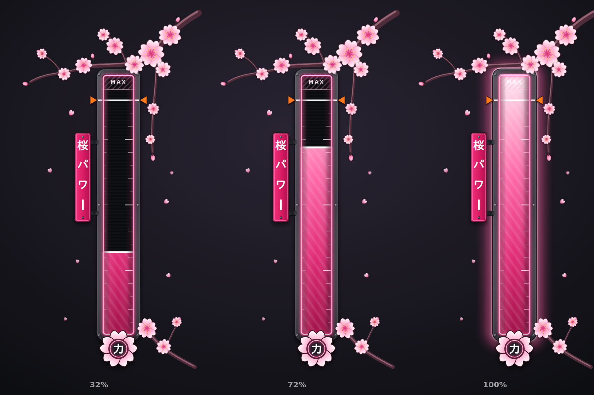

# Sakura Power meter (HEX!)

A vertical power/charge meter styled like the map's Shibuya signage: a gunmetal sign frame with bolts
and mounting brackets, a pink LED tube, a tategaki 桜パワー plate, a 力 emblem and a vector sakura
branch. It's clean vector art (rendered from `design.html`), not painted.

## Files (`png/`, all transparent)
| File | Size | Use |
|---|---|---|
| `sakura_power_back.png` | 512x1024 | bottom layer: frame + dark track |
| `sakura_power_fill.png` | 92x722 | power gradient (revealed from the bottom) |
| `sakura_power_cap.png` | 92x28 | bright leading edge on top of the fill |
| `sakura_power_overlay.png` | 512x1024 | top layer: ticks, MAX zone, neon tube, plate, badge, sakura |
| `sakura_power_glow.png` | 512x1024 | pink halo for full charge / perfect release |
| `sakura_power_marker.png` | 160x40 | perfect-release marker (HEX orange) |
| `sakura_power_petal.png` | 128x128 | petal particle for the release burst |
| `sakura_power_preview.png` | 1536x1024 | preview at 32 / 72 / 100% |

The track sits at **x 264, y 204, w 92, h 722** inside the 512x1024 canvas.

## Roblox
1. Upload the PNGs and paste their asset IDs into `ASSETS` in `roblox/SakuraPowerMeter.lua`.
2. Put `SakuraPowerMeter.lua` in ReplicatedStorage as a **ModuleScript** named `SakuraPowerMeter`.
3. Optional: `roblox/SakuraPowerDemo.client.lua` in StarterPlayerScripts. Hold click/touch to charge,
   release to shoot.

API: `Meter.new(playerGui, height?)`, `:SetPower(0..1)`, `:SetPerfectWindow(lo, hi)`, `:IsPerfect()`,
`:Release()` (glow flash and petal burst when perfect), `:SetVisible(bool)`, `:Destroy()`.

## Editing
Change colours, text and layout in `design.html`, then run `node render.mjs` (needs Playwright with
Chromium).
